# Entrega 1 Diseño y construcción de soluciones no monolíticas

## Documentación de Dominios y Subdominios

En la carpetas `src-gen` y `out\src-gen` se pueden encontrar los cuatro puntos resueltos, incluyendo el bono, relacionados con la documentación de dominios y subdominios.

### Almacenamiento De Imagenes
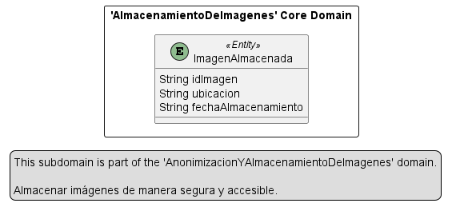
### Anonimizacion De Imagenes
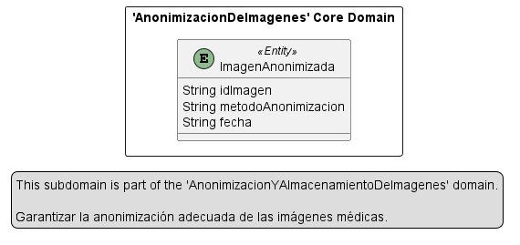
### Captura De Datos Medicos
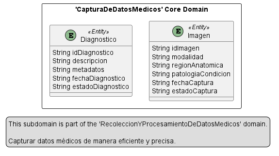
### Colaboracion Con Desarrolladores De IA
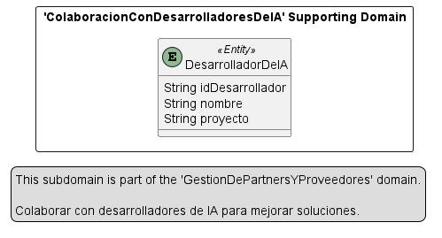
### Cumplimiento De Normativas
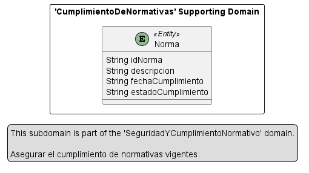
### Data Partnership
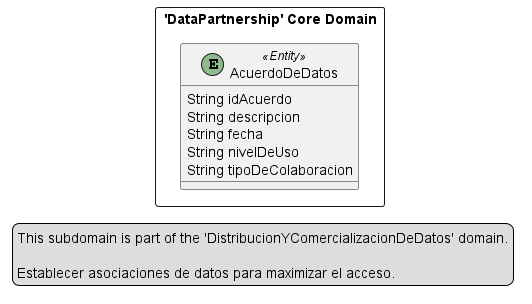
### Estrategias De Comercializacion
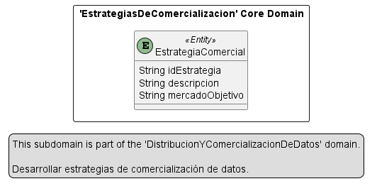
### Modelos De Facturacion
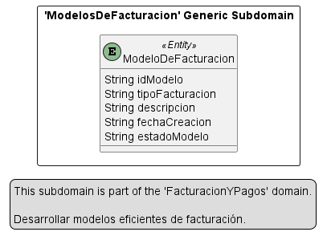
### ProcesamientoDeImagenesMedicas
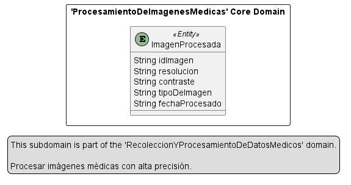
### Proceso De Pagos
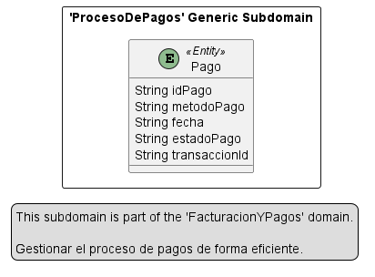
### Relacion Con Proveedores De Datos
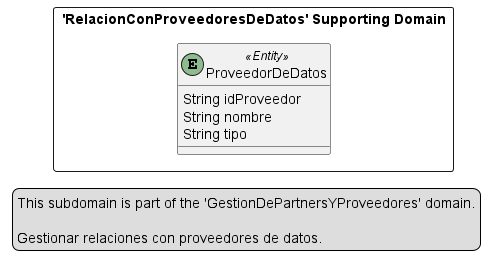
### Seguridad De Datos
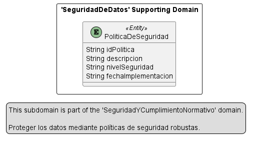
### Servicios De Acceso A Datos Para IA
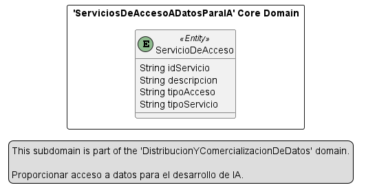
### STA Enterprise
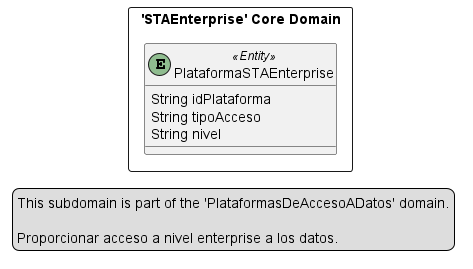
### STA Pro
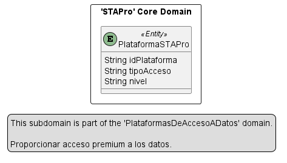
### STA Standard
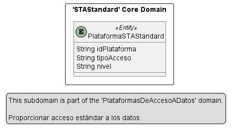
### Verificacion De Calidad De Datos
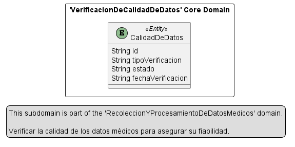
### Use Cases
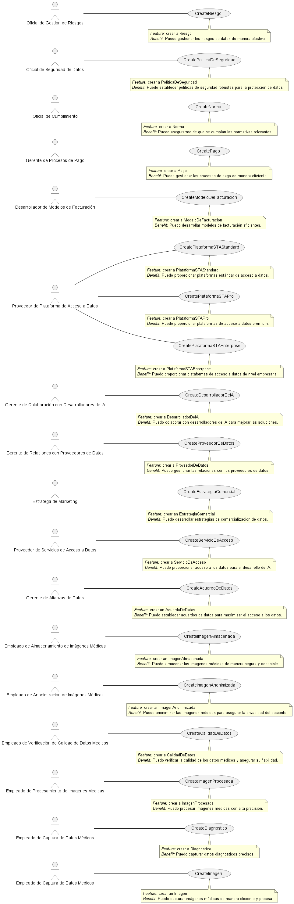

## Generación de Diagramas PUML

Si se desea volver a generar los archivos PUML, es necesario contar con las siguientes herramientas instaladas en Visual Studio Code:

1. **Extensión Context Mapper**
2. **Extensiones requeridas de Java**

Estas herramientas permiten visualizar y regenerar los diagramas de los dominios y subdominios de manera correcta.

## Uso

Para acceder a la documentación y las imagenes generadas:

1. Navegar a la carpeta `src-gen`.
2. Explorar los archivos generados para visualizar la información detallada.
3. Para regenerar los diagramas, abrir los archivos en Visual Studio Code y utilizar la extensión Context Mapper.

---

## Documentación del lenguaje ubicuo 

### Event Storming - AS-IS
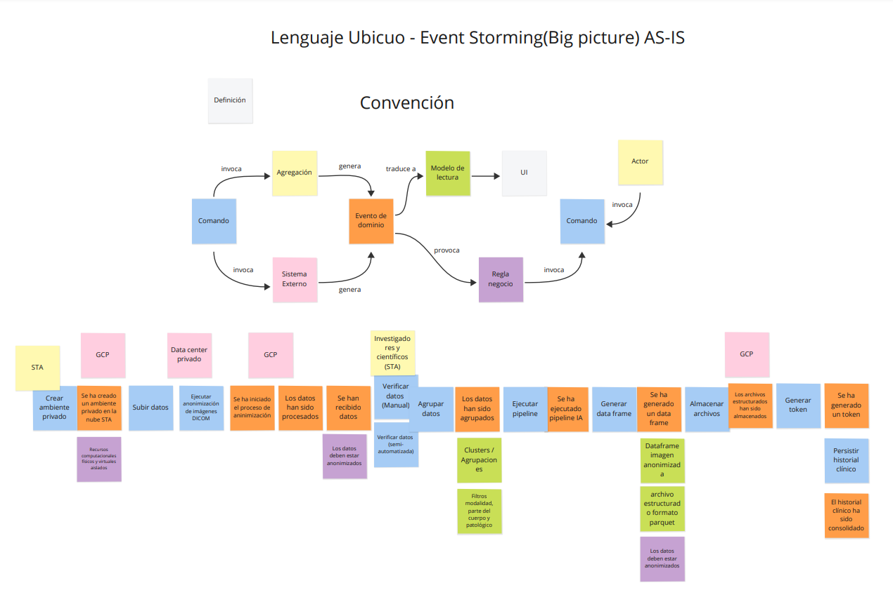
### Event Storming - TO-BE
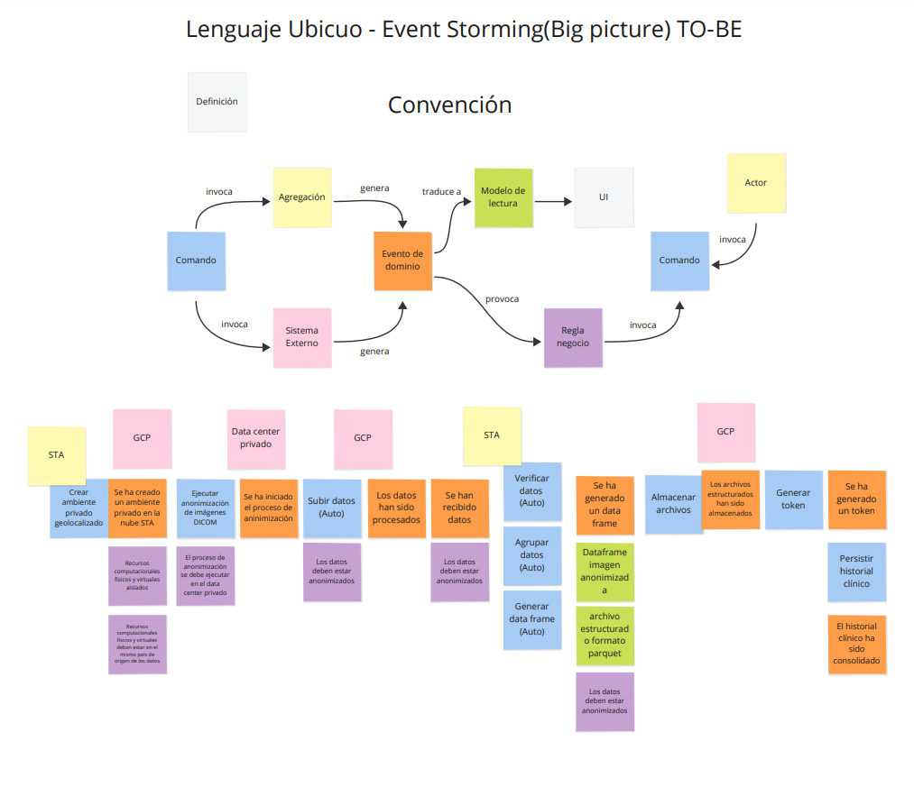

---

## Documentación de contextos acotados 

### AS-IS ContextMap
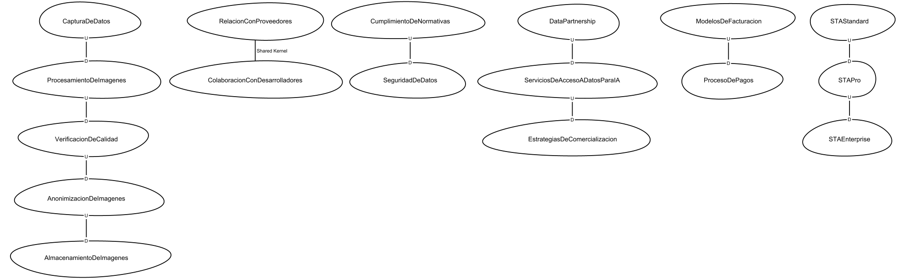
### TO-BE ContextMap
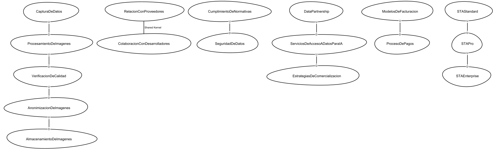

---
