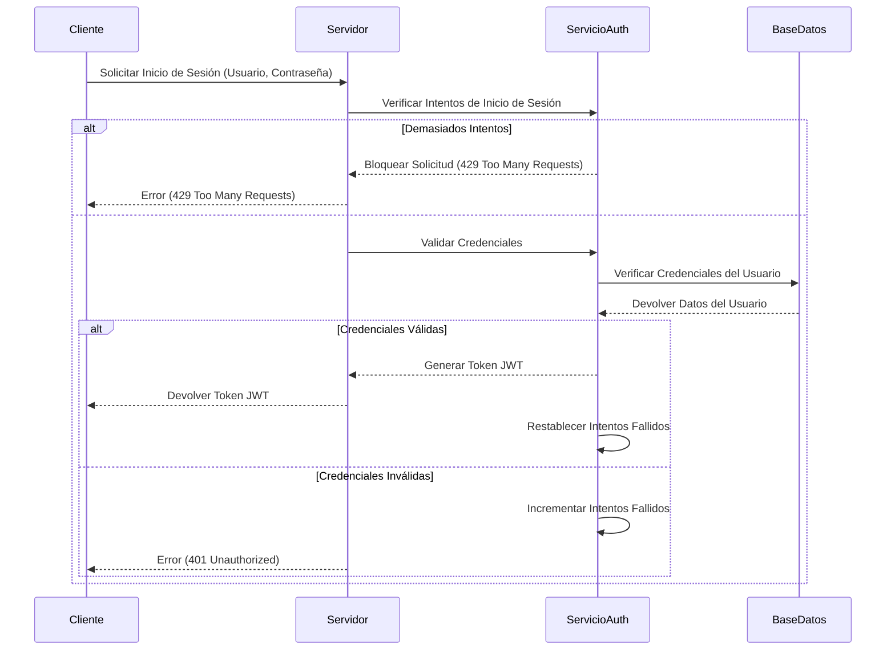
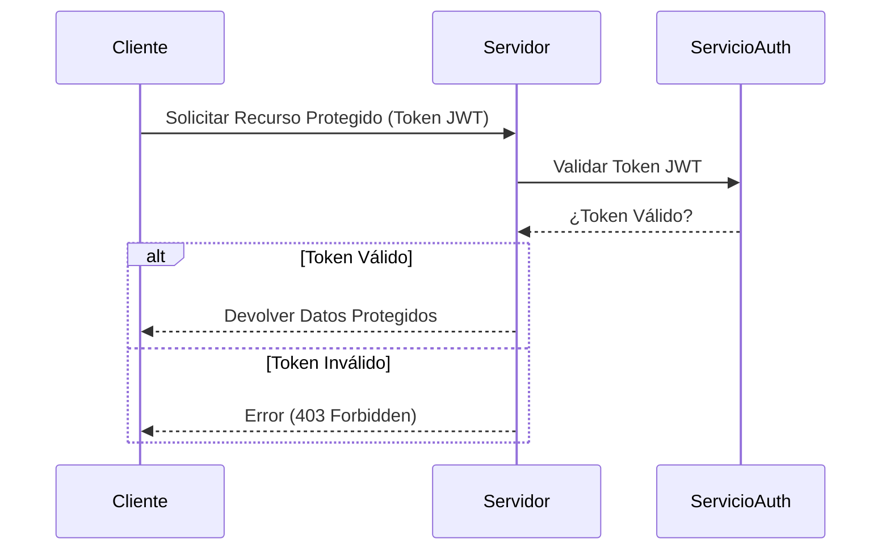
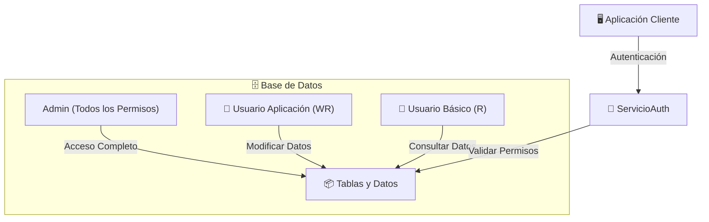

# Sobre seguridad en los requests

```mermaid
sequenceDiagram
    participant Cliente
    participant Servidor
    participant ServicioAuth
    participant BaseDatos

    Cliente->>Servidor: Solicitar Inicio de Sesión (Usuario, Contraseña)
    Servidor->>ServicioAuth: Verificar Intentos de Inicio de Sesión
    alt Demasiados Intentos
        ServicioAuth-->>Servidor: Bloquear Solicitud (429 Too Many Requests)
        Servidor-->>Cliente: Error (429 Too Many Requests)
    else
        Servidor->>ServicioAuth: Validar Credenciales
        ServicioAuth->>BaseDatos: Verificar Credenciales del Usuario
        BaseDatos-->>ServicioAuth: Devolver Datos del Usuario
        alt Credenciales Válidas
            ServicioAuth-->>Servidor: Generar Token JWT
            Servidor-->>Cliente: Devolver Token JWT
            ServicioAuth->>ServicioAuth: Restablecer Intentos Fallidos
        else Credenciales Inválidas
            ServicioAuth->>ServicioAuth: Incrementar Intentos Fallidos
            Servidor-->>Cliente: Error (401 Unauthorized)
        end
    end
```

```mermaid
sequenceDiagram
    participant Cliente
    participant Servidor
    participant ServicioAuth

    Cliente->>Servidor: Solicitar Recurso Protegido (Token JWT)
    Servidor->>ServicioAuth: Validar Token JWT
    ServicioAuth-->>Servidor: ¿Token Válido?
    alt Token Válido
        Servidor-->>Cliente: Devolver Datos Protegidos
    else Token Inválido
        Servidor-->>Cliente: Error (403 Forbidden)
    end
```

# Sobre seguridad en los requests

```mermaid
graph TD;
    subgraph "🗄️ Base de Datos"
        Admin["Admin (Todos los Permisos)"] -->|Acceso Completo| BD["📦 Tablas y Datos"]
        UsuarioAvanzado["👤 Usuario Aplicación (WR)"] -->|Modificar Datos| BD
        UsuarioBasico["👤 Usuario Básico (R)"] -->|Consultar Datos| BD
    end
    
    Cliente["🖥️ Aplicación Cliente"] -->|Autenticación| ServicioAuth["🔑 ServicioAuth"]
    ServicioAuth -->|Validar Permisos| BD
```